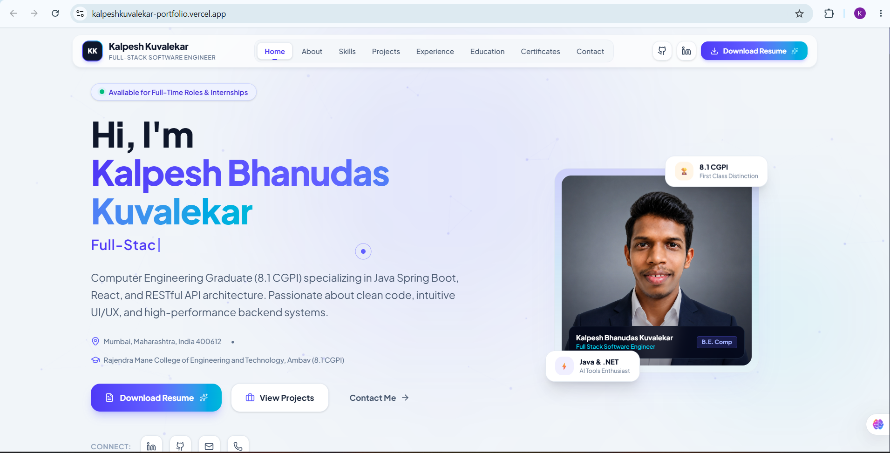

# Kalpesh Kuvalekar - Premium Developer Portfolio

A modern, high-performance personal portfolio website built for **Kalpesh Bhanudas Kuvalekar** (Full-Stack Software Engineer & Computer Engineering Graduate).

Designed to create an immediate 5-second impact on technical recruiters, engineering managers, and talent acquisition teams.



---

## 🌟 Key Features

- **Dark Mode Default with Light Mode Toggle**: Sleek dark ambient theme with persistent theme preference sync.
- **Dynamic Typewriter & Particle Background**: Interactive HTML5 canvas mesh network and typing headline animation.
- **Structured Data Architecture**: All portfolio information is managed in `src/data/portfolioData.ts` for zero-code updates.
- **Interactive Project Showcase**: Categorized project filter tabs, high-res previews, tech stack badges, and architecture modal breakdown.
- **Recruiter Elevator Pitch & Academic Distinction**: Highlights B.E. Computer Engineering degree (8.1 CGPI) and verified industry training.
- **Interactive Resume Modal**: Print-friendly resume view with 1-click text copying and direct PDF print triggers.
- **Recruiter Contact Form**: Form validation, toast notifications, direct `mailto:` fallback, and click-to-copy email/phone tools.
- **Full Mobile Responsiveness**: Mobile drawer menu, fluid layout containers, touch-optimized button targets.

---

## 🛠️ Built With

- **React 19**
- **Vite 6**
- **Tailwind CSS 4**
- **Motion (Framer Motion)**
- **Lucide React Icons**
- **TypeScript**

---

## 🚀 Getting Started

### Prerequisites

Ensure you have **Node.js** (v18.0.0 or higher) and **npm** installed on your system.

### 1. Installation

```bash
npm install
```

### 2. Run Local Development Server

```bash
npm run dev
```

Open your browser and navigate to `http://localhost:3000`.

### 3. Build for Production

```bash
npm run build
```

The production output will be generated inside the `dist/` directory.

---

## ✏️ How to Customize Your Portfolio

All content on the website is decoupled from UI components and stored in a single source of truth file:

📁 `src/data/portfolioData.ts`

### 1. Updating Personal Information
Edit `personal` inside `portfolioData.ts`:
```typescript
personal: {
  name: 'Kalpesh Bhanudas Kuvalekar',
  title: 'Full-Stack Software Engineer',
  email: 'Kalpeshkuvalekar02@gmail.com',
  phone: '+91 9503792865',
  location: 'Mumbai, Maharashtra, India',
  // ...
}
```

### 2. Updating Profile Photo & Project Images
Place your new image inside `src/assets/images/` and update the import in `portfolioData.ts`:
```typescript
import profileImg from '../assets/images/my_new_photo.jpg';
```

### 3. Adding/Editing Projects
Append a new project object to the `projects` array inside `portfolioData.ts`:
```typescript
{
  id: 'my-new-project',
  title: 'E-Commerce Platform',
  subtitle: 'Full-Stack React & Spring Boot App',
  category: 'Full Stack',
  description: 'Project brief...',
  fullDescription: 'Detailed architectural overview...',
  image: projectImg,
  features: ['Feature 1', 'Feature 2'],
  techStack: ['React', 'Spring Boot', 'MySQL'],
  githubUrl: 'https://github.com/...',
  liveUrl: 'https://demo.com'
}
```

---

## 🌐 Deployment Instructions

### Option 1: Deploy to Vercel (Recommended)

1. Push your repository to **GitHub**.
2. Go to [Vercel](https://vercel.com) and click **"Add New Project"**.
3. Import your GitHub repository.
4. Framework Preset will be automatically detected as **Vite**.
5. Click **"Deploy"**.

### Option 2: Deploy to Netlify

1. Log into [Netlify](https://netlify.com) and select **"Add new site"** > **"Import an existing project"**.
2. Connect your GitHub repository.
3. Configure settings:
   - **Build command**: `npm run build`
   - **Publish directory**: `dist`
4. Click **"Deploy site"**.

### Option 3: Deploy to GitHub Pages

1. Install `gh-pages`:
   ```bash
   npm install -D gh-pages
   ```
2. In `package.json`, add a deploy script:
   ```json
   "scripts": {
     "predeploy": "npm run build",
     "deploy": "gh-pages -d dist"
   }
   ```
3. Run deploy:
   ```bash
   npm run deploy
   ```

---

## 📄 License

This project is open-source under the Apache-2.0 License.

Developed for **Kalpesh Bhanudas Kuvalekar**.
